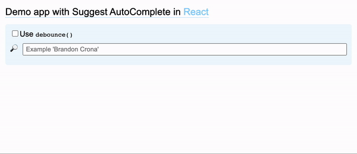

# demo-react-suggest

🚁 Demo project with "suggest pattern" in React



## Technologies

* :white_check_mark: Vite `v4.3.9`
* :white_check_mark: React `v18.2.0`
* :white_check_mark: TypeScript `v5.0.2`
* :white_check_mark: ESLint `v8.38.0`

## Getting started

```bash
npm install
npm run dev
```

## License

[The MIT License](http://piecioshka.mit-license.org) @ 2023
